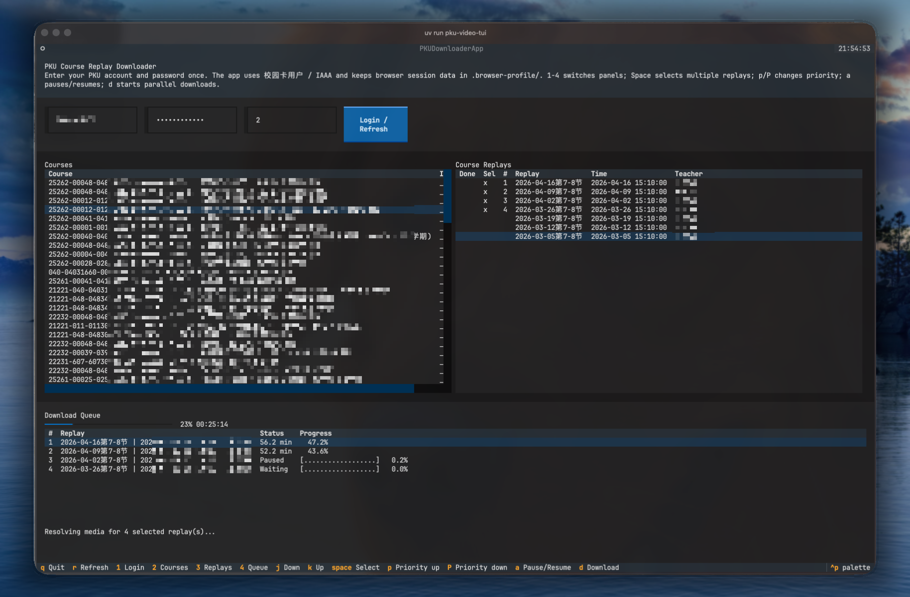

# PKU Course Videos Downloader


A small project for downloading PKU course replay videos from `https://course.pku.edu.cn/`.

一个从北京大学课程网站下载课程回放视频的 TUI 工具。

The main interface is a terminal UI that logs in through PKU `校园卡用户` / IAAA, lists your available courses, shows replay videos, and downloads selected items with queue priority and pause/resume support.

## Notice

This tool is intended only to help PKU students study their enrolled courses offline. Course videos, slides, audio, and related teaching materials are copyrighted by PKU and/or the course instructors.

Do not upload, redistribute, publicly share, stream, broadcast, or otherwise spread downloaded videos. Use the files only for your own study, and follow PKU course website rules and your instructors' requirements.

## Screenshot



## Features

- Logs in through PKU IAAA and reuses browser session data from `.browser-profile/`.
- Lists courses available to the current account.
- Caches replay lists per course while the TUI is open.
- Supports multi-select downloads with queue priority.
- Supports `j/k/h/l` navigation and `1/2/3/4` panel switching.
- Supports pause/resume and configurable parallel workers.
- Tracks completed files in `downloads/` and avoids repeated downloads.

## Setup

```bash
uv sync
uv run playwright install chromium
```

`ffmpeg` is required when a replay is served as HLS (`.m3u8`):

```bash
brew install ffmpeg
```

## TUI Usage

Start the terminal UI:

```bash
uv run pku-video-tui
```

Workflow:

1. Enter your PKU account and password.
2. Press `Login / Refresh`.
3. Choose a course from the courses panel.
4. Use `space` to select one or more replays.
5. Press `d` to download the queue.

The app does not write your password to project files. Browser cookies/session data are stored under `.browser-profile/`.

Keys:

```text
j/k       move down/up
h/l       focus courses/replays
1/2/3/4   focus login/courses/replays/queue
space     open course, select/unselect replay, or remove queued item
p/P       raise/lower selected replay priority
a         pause/resume active downloads
d         download selected replays
r         refresh courses
q         quit
```

Set the `Workers` input to control maximum concurrent downloads. If queue priority changes while downloads are active, only the current top `Workers` runnable items continue; items that fall out of the active window pause until they return to priority.

Downloaded files are saved under:

```text
downloads/<course-name>/<course>-<teacher>-<time>.mp4
```

Partial files use:

```text
downloads/<course-name>/<course>-<teacher>-<time>.tmp.mp4
```

Only completed `.mp4` files are marked as downloaded in the replay table.

## CLI Usage

The CLI is useful for downloading a single replay URL. Do not put your password in source files. Use environment variables or let the tool prompt for credentials:

```bash
export PKU_ACCOUNT='your-student-id'
export PKU_PASSWORD='your-password'

uv run pku-video 'https://course.pku.edu.cn/webapps/bb-streammedia-hqy-BBLEARN/playVideo.action?token=...'
```

Useful options:

```bash
uv run pku-video --print-media-url '<replay-url>'
uv run pku-video --name lecture-01 '<replay-url>'
uv run pku-video --keep-browser-open '<replay-url>'
```

Downloaded files are saved under `downloads/`.
